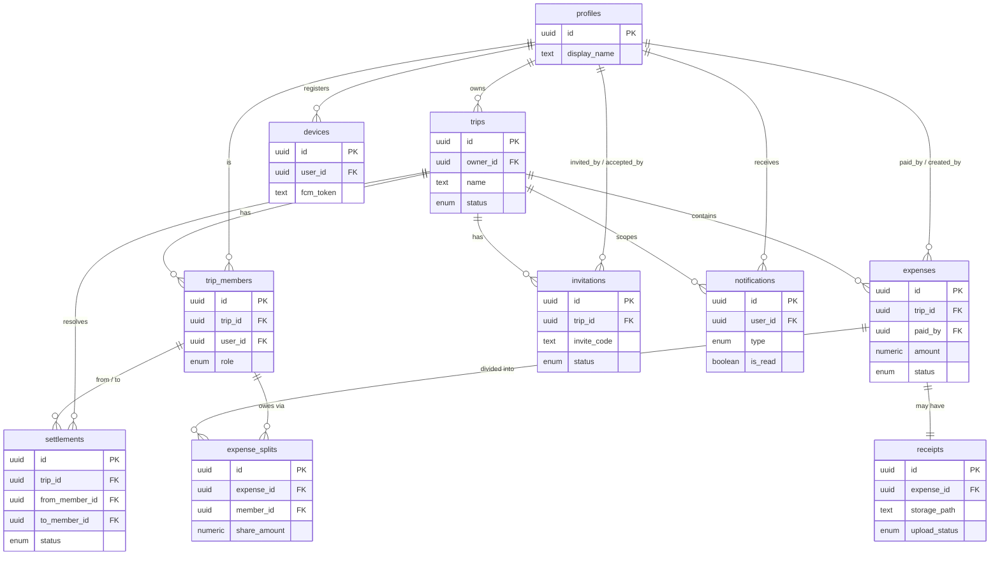

# TripMate — Database Design Document

**Version:** 1.0
**Status:** Ready for Engineering
**Last Updated:** 2026-06-26
**Author:** Principal Database Architect
**Companion Docs:** Product Vision v1.0, PRD v2.0, Technical Architecture v1.0
**Scope:** Data architecture only. No SQL DDL, no API contracts, no PRD/Architecture restatement.

---

## 1. Database Overview

TripMate uses **PostgreSQL (via Supabase)** as the durable server store and **SQLite (via Drift)** as the on-device store. This document describes the **server (Postgres) schema design**; the local Drift schema mirrors it with a reduced column set plus sync bookkeeping (§8).

**Design tenets:**
- **Normalized (3NF)** core with deliberate, documented derived/denormalized exceptions (settlement snapshots, budget rollups computed client-side, not stored).
- **UUID primary keys** (`uuid`, default `gen_random_uuid()`) on every table — required for offline-first (clients generate IDs before sync; no server round-trip for ID allocation).
- **Soft delete everywhere** business data lives (§6) — never hard-delete user-recoverable records.
- **Multi-tenant by trip** — every shared row is reachable from a `trip_id`; this is the RLS anchor (§9).
- **Audit + sync columns** standardized across all mutable tables (§7, §8).
- **Enums via Postgres `enum` types** for closed value sets (status fields) to enforce integrity at the DB layer.
- **Timestamps:** `timestamptz` (UTC) everywhere; never naive timestamps.

**Key identifiers:**
- `auth.users.id` (Supabase Auth) is the canonical user identity. App tables reference it via `user_id`; we keep a lightweight `profiles` table for app-level user data.

---

## 2. Entity Relationship Diagram (Mermaid)

---

## 3. Complete Entity List

| # | Table | Why it exists |
|---|-------|---------------|
| 1 | `profiles` | App-level user data extending `auth.users` (name, avatar, tier). Auth table is not directly extendable. |
| 2 | `trips` | The aggregate root for all collaborative data; tenant boundary. |
| 3 | `trip_members` | Join table mapping users↔trips with role; the RLS membership source of truth. |
| 4 | `invitations` | Pending/accepted/rejected invites with codes + expiry; decouples "invited" from "member". |
| 5 | `expenses` | Core financial record; parent of splits and receipt. |
| 6 | `expense_splits` | Per-member share of an expense; normalizes the many-to-many "who owes what". |
| 7 | `settlements` | Computed "who pays who" transactions + payment status. |
| 8 | `receipts` | Metadata for a Storage object attached to an expense (1:1). |
| 9 | `notifications` | Per-user notification feed/history backing push. |
| 10 | `devices` | Per-user FCM tokens for push targeting; supports multi-device. |
| 11 | `audit_log` *(optional, P2)* | Append-only record of sensitive actions (approvals, deletes, role changes). |

> Budget is **not** a table — total budget is a column on `trips`; spent/remaining/daily are **derived client-side** (Architecture §1), so they are intentionally not persisted to avoid drift.

---

## 4. Table-by-Table Design

> Notation: type + nullability + notes. PK = primary key, FK = foreign key. All `*_at` are `timestamptz`. All IDs are `uuid`.

### 4.1 `profiles`
- **Purpose:** Application profile for each authenticated user; mirrors `auth.users.id`.
- **Fields:**
  - `id` uuid — PK, **= auth.users.id** (1:1).
  - `display_name` text, not null.
  - `avatar_url` text, null.
  - `email` text, null (denormalized for display; source of truth is auth).
  - `phone` text, null.
  - `tier` enum(`free`,`premium`), not null, default `free`.
  - `created_at`, `updated_at` (§7).
- **PK:** `id`. **FK:** `id` → `auth.users.id` (ON DELETE CASCADE).
- **Constraints:** `display_name` length 1–60.
- **Indexes:** PK; optional unique partial on `email` where not null (display only).

### 4.2 `trips`
- **Purpose:** Aggregate root and tenant boundary.
- **Fields:**
  - `id` uuid — PK.
  - `owner_id` uuid, not null → `profiles.id`.
  - `name` text, not null (1–60).
  - `destination` text, null.
  - `start_date` date, null; `end_date` date, null.
  - `currency` text, not null (ISO-4217, default from client locale).
  - `total_budget` numeric(14,2), null, check ≥ 0.
  - `status` enum(`active`,`archived`,`deleted`), not null, default `active`.
  - Audit (§7) + sync (§8).
- **PK:** `id`. **FK:** `owner_id` → `profiles.id` (ON DELETE RESTRICT — cannot delete a user who owns trips; handle via ownership transfer).
- **Constraints:** `end_date >= start_date` when both present; `name` length check; `currency` length = 3.
- **Indexes:**
  - `idx_trips_owner` on `(owner_id)`.
  - Partial `idx_trips_active` on `(owner_id)` where `status = 'active' and deleted_at is null` (free-tier limit checks).
  - `idx_trips_updated` on `(updated_at)` for delta sync.

### 4.3 `trip_members`
- **Purpose:** Membership + role; the anchor for all RLS membership checks.
- **Fields:**
  - `id` uuid — PK.
  - `trip_id` uuid, not null → `trips.id`.
  - `user_id` uuid, not null → `profiles.id`.
  - `role` enum(`owner`,`member`,`admin`), not null, default `member` (`admin` reserved, v1.5).
  - `status` enum(`active`,`removed`), not null, default `active`.
  - `joined_at` timestamptz, not null.
  - `removed_at` timestamptz, null.
  - Audit (§7) + sync (§8).
- **PK:** `id`. **FK:** `trip_id` → `trips.id` (ON DELETE CASCADE); `user_id` → `profiles.id` (ON DELETE RESTRICT — preserve attribution).
- **Constraints:**
  - **Unique** `(trip_id, user_id)` — one membership per user per trip.
  - Partial unique: at most one `role = 'owner'` per trip (enforce via unique index `(trip_id)` where `role='owner'`).
- **Indexes:**
  - Unique `(trip_id, user_id)`.
  - `idx_members_user` on `(user_id)` — "my trips" lookup + RLS.
  - `idx_members_trip_active` on `(trip_id)` where `status='active'`.

### 4.4 `invitations`
- **Purpose:** Track invite lifecycle independent of membership.
- **Fields:**
  - `id` uuid — PK.
  - `trip_id` uuid, not null → `trips.id`.
  - `invited_by` uuid, not null → `profiles.id`.
  - `target_email` text, null; `target_phone` text, null (either may be set for direct invites).
  - `invite_code` text, not null — **unique**, high-entropy, used in deep link.
  - `status` enum(`pending`,`accepted`,`rejected`,`expired`), not null, default `pending`.
  - `expires_at` timestamptz, not null (default now + 7 days).
  - `accepted_by` uuid, null → `profiles.id`.
  - Audit (§7) + sync (§8).
- **PK:** `id`. **FK:** `trip_id` → `trips.id` (CASCADE); `invited_by`/`accepted_by` → `profiles.id` (RESTRICT/SET NULL).
- **Constraints:**
  - **Unique** `invite_code`.
  - Partial unique `(trip_id, target_email)` where `status='pending'` (one pending invite per invitee); same for `target_phone`.
- **Indexes:**
  - Unique `invite_code` (primary lookup path on accept).
  - `idx_inv_trip_status` on `(trip_id, status)`.
  - `idx_inv_expiry` on `(expires_at)` where `status='pending'` (expiry sweep).

### 4.5 `expenses`
- **Purpose:** Core financial transaction record.
- **Fields:**
  - `id` uuid — PK.
  - `trip_id` uuid, not null → `trips.id`.
  - `paid_by` uuid, not null → `trip_members.id` (the member who paid).
  - `amount` numeric(14,2), not null, check > 0.
  - `currency` text, not null (= trip currency in v1.0).
  - `category` enum(`food`,`fuel`,`accommodation`,`transport`,`toll`,`drinks`,`shopping`,`activities`,`parking`,`misc`), not null.
  - `description` text, null.
  - `expense_date` timestamptz, not null, default now.
  - `status` enum(`pending`,`approved`,`rejected`), not null, default `pending`.
  - `split_type` enum(`equal`,`custom`,`percentage`), not null, default `equal` (`custom`/`percentage` v1.5).
  - `receipt_id` uuid, null → `receipts.id` (denormalized convenience; canonical link is `receipts.expense_id`).
  - Audit (§7, incl. `created_by`) + sync (§8).
- **PK:** `id`. **FK:** `trip_id` → `trips.id` (CASCADE); `paid_by` → `trip_members.id` (RESTRICT — keep attribution of removed members).
- **Constraints:** `amount > 0`; `expense_date` not in far future (sanity check optional).
- **Indexes:**
  - `idx_exp_trip` on `(trip_id)`.
  - `idx_exp_trip_status` on `(trip_id, status)` where `deleted_at is null` (budget/settlement reads).
  - `idx_exp_trip_date` on `(trip_id, expense_date)` (timeline reports).
  - `idx_exp_updated` on `(updated_at)` (delta sync).

### 4.6 `expense_splits`
- **Purpose:** Normalized per-member share of an expense.
- **Fields:**
  - `id` uuid — PK.
  - `expense_id` uuid, not null → `expenses.id`.
  - `member_id` uuid, not null → `trip_members.id`.
  - `share_amount` numeric(14,2), not null, check ≥ 0.
  - `share_percent` numeric(5,2), null (v1.5 percentage splits).
  - Audit (§7) + sync (§8).
- **PK:** `id`. **FK:** `expense_id` → `expenses.id` (**ON DELETE CASCADE** — splits die with the expense); `member_id` → `trip_members.id` (RESTRICT).
- **Constraints:**
  - **Unique** `(expense_id, member_id)` — one share per member per expense.
  - Application invariant (validated client + Edge Function): sum(`share_amount`) = `expenses.amount` (rounding remainder to payer). Not a DB constraint (cross-row); enforce in logic.
- **Indexes:**
  - Unique `(expense_id, member_id)`.
  - `idx_splits_member` on `(member_id)` (settlement aggregation).

### 4.7 `settlements`
- **Purpose:** Materialized "who pays who" transactions + payment status. Stored (not purely derived) because payment status is user-mutated state that must persist and sync.
- **Fields:**
  - `id` uuid — PK.
  - `trip_id` uuid, not null → `trips.id`.
  - `from_member_id` uuid, not null → `trip_members.id` (debtor).
  - `to_member_id` uuid, not null → `trip_members.id` (creditor).
  - `amount` numeric(14,2), not null, check > 0.
  - `status` enum(`pending`,`completed`), not null, default `pending`.
  - `marked_by` uuid, null → `trip_members.id`.
  - `completed_at` timestamptz, null.
  - Audit (§7) + sync (§8).
- **PK:** `id`. **FK:** `trip_id` → `trips.id` (CASCADE); member FKs → `trip_members.id` (RESTRICT).
- **Constraints:** `from_member_id <> to_member_id`; `amount > 0`.
- **Indexes:**
  - `idx_settle_trip_status` on `(trip_id, status)`.
  - `idx_settle_from`/`idx_settle_to` on member columns for per-user dues.

### 4.8 `receipts`
- **Purpose:** Metadata for a Storage object (1:1 with expense). Binary lives in Storage, not the DB.
- **Fields:**
  - `id` uuid — PK.
  - `expense_id` uuid, not null → `expenses.id` (**unique** — 1:1 in v1.0).
  - `storage_path` text, null until uploaded (`bucket-relative path`).
  - `upload_status` enum(`pending`,`uploaded`,`failed`), not null, default `pending`.
  - `size_bytes` bigint, null, check ≤ 10 MB.
  - `mime_type` text, null (`image/jpeg|png|heic`).
  - Audit (§7) + sync (§8).
- **PK:** `id`. **FK:** `expense_id` → `expenses.id` (**ON DELETE CASCADE**).
- **Constraints:** **Unique** `expense_id`.
- **Indexes:** Unique `(expense_id)`; `idx_receipts_status` on `(upload_status)` where `pending`/`failed` (cleanup/retry jobs).

### 4.9 `notifications`
- **Purpose:** Per-user notification history backing the push feed.
- **Fields:**
  - `id` uuid — PK.
  - `user_id` uuid, not null → `profiles.id` (recipient).
  - `trip_id` uuid, null → `trips.id`.
  - `type` enum(`invite_received`,`invite_accepted`,`member_removed`,`expense_added`,`expense_pending_approval`,`expense_approved`,`expense_rejected`,`budget_exceeded`,`settlement_pending`,`settlement_completed`,`trip_archived`), not null.
  - `title` text, not null; `body` text, not null.
  - `payload` jsonb, null (deep-link target).
  - `is_read` boolean, not null, default false.
  - `created_at` (§7).
- **PK:** `id`. **FK:** `user_id` → `profiles.id` (CASCADE); `trip_id` → `trips.id` (CASCADE).
- **Constraints:** none beyond enums.
- **Indexes:** `idx_notif_user_unread` on `(user_id, is_read, created_at desc)`.

### 4.10 `devices`
- **Purpose:** FCM token registry for push targeting; supports multi-device.
- **Fields:**
  - `id` uuid — PK.
  - `user_id` uuid, not null → `profiles.id`.
  - `fcm_token` text, not null — **unique**.
  - `platform` enum(`android`,`ios`,`web`), not null.
  - `last_seen_at` timestamptz, not null.
  - `created_at` (§7).
- **PK:** `id`. **FK:** `user_id` → `profiles.id` (CASCADE).
- **Constraints:** **Unique** `fcm_token`.
- **Indexes:** Unique `(fcm_token)`; `idx_devices_user` on `(user_id)`.

### 4.11 `audit_log` *(optional, P2)*
- **Purpose:** Append-only trail for sensitive actions (approve/reject, delete, role change, ownership transfer).
- **Fields:** `id` uuid PK; `trip_id` uuid; `actor_id` uuid; `action` text; `entity_type` text; `entity_id` uuid; `metadata` jsonb; `created_at`.
- **PK:** `id`. **FK:** soft references (no cascade; immutable history).
- **Indexes:** `idx_audit_trip_time` on `(trip_id, created_at desc)`.

---

## 5. Relationship Definitions

| Relationship | Type | Cascade |
|--------------|------|---------|
| `profiles` ↔ `auth.users` | 1:1 | user delete → profile CASCADE |
| `trips` → `profiles` (owner) | N:1 | RESTRICT (transfer before delete) |
| `trip_members` → `trips` | N:1 | CASCADE |
| `trip_members` → `profiles` | N:1 | RESTRICT (attribution) |
| `invitations` → `trips` | N:1 | CASCADE |
| `expenses` → `trips` | N:1 | CASCADE |
| `expenses` → `trip_members` (paid_by) | N:1 | RESTRICT |
| `expense_splits` → `expenses` | N:1 | CASCADE |
| `expense_splits` → `trip_members` | N:1 | RESTRICT |
| `settlements` → `trips` | N:1 | CASCADE |
| `settlements` → `trip_members` (from/to) | N:1 | RESTRICT |
| `receipts` → `expenses` | 1:1 | CASCADE |
| `notifications` → `profiles`/`trips` | N:1 | CASCADE |
| `devices` → `profiles` | N:1 | CASCADE |

**Cascade philosophy:** structural ownership (trip → its rows, expense → its splits/receipt) uses **CASCADE**; references that exist for **attribution/integrity** (a user/member referenced by financial rows) use **RESTRICT**, so financial history is never silently orphaned. Note CASCADE here means **DB-level hard cascade on hard delete only**; routine user "deletes" are soft (§6) and never trigger these.

---

## 6. Soft Delete Strategy

- **Soft-deletable tables:** `trips`, `trip_members`, `expenses`, `expense_splits`, `settlements`, `receipts`, `invitations`.
- **Mechanism:** `deleted_at timestamptz null`. A row is "deleted" when `deleted_at is not null`; `trips`/`trip_members` also carry an explicit `status` enum for richer lifecycle.
- **Read rule:** all application queries and RLS policies filter `deleted_at is null` by default; recovery views opt in.
- **Cascade on soft delete:** handled in **application/Edge Function logic** (set `deleted_at` on children), not DB triggers, to keep it deterministic and sync-friendly. Soft-deleting a trip soft-deletes its members/expenses/splits/settlements.
- **Hard delete:** only via the retention job (§14) after the recovery window, or auth-user deletion (GDPR). DB-level CASCADE FKs apply only at that point.
- **Restore:** clear `deleted_at` (and reset `status`) within the window; children restored in the same transaction.
- **Indexes:** hot indexes are **partial** (`where deleted_at is null`) to keep them lean despite retained tombstones.

---

## 7. Audit Fields

Standard on every mutable table:

| Field | Type | Rule |
|-------|------|------|
| `created_at` | timestamptz, not null, default `now()` | Set once. |
| `updated_at` | timestamptz, not null, default `now()` | Bumped on every update (trigger **and** client-provided value reconciled — see §8). |
| `deleted_at` | timestamptz, null | Soft-delete tombstone (§6). |
| `created_by` | uuid, null → `profiles.id` | Actor who created the row (audit + permission attribution). |
| `updated_by` | uuid, null → `profiles.id` | Actor of last update (where relevant). |

Notes:
- `updated_at` is both an **audit** field and the **sync delta cursor** (§8) — it does double duty.
- A DB trigger sets `updated_at = now()` on update; for **offline conflict resolution**, last-write-wins compares the **client-stamped** `updated_at` in the payload, with the server trigger as backstop. Keep these reconciled (Edge Function trusts the larger of the two within skew tolerance).
- `notifications`/`devices`/`audit_log` need only `created_at` (immutable/feed rows).

---

## 8. Offline Sync Fields

Sync-participating tables (everything synced to Drift) carry:

| Field | Type | Purpose |
|-------|------|---------|
| `id` | uuid (PK) | **Client-generated** UUID = the durable ID; no server remap needed. |
| `local_id` | uuid, null | *Local-only in Drift*, not stored server-side. (Server `id` is authoritative; `local_id` exists only if a client uses a separate scheme — default is to reuse `id`.) |
| `updated_at` | timestamptz | Delta cursor + LWW comparator (§7). |
| `version` | integer, not null, default 1 | Optimistic concurrency counter; incremented each update. Detects conflicting concurrent writes (server compares incoming `version`). |
| `sync_status` | *(Drift-only)* enum(`synced`,`pending`,`failed`) | Local bookkeeping; **never** stored in Postgres. |
| `idempotency_key` | uuid, null | Dedupe retried creates; **unique** where not null (per table) to make replays safe. |
| `last_synced_at` | *(Drift-only)* timestamptz | Local cursor. |

**Design choices for offline-first:**
- **Client-generated UUID PKs** eliminate the create→serverId remap round-trip entirely; a row created offline keeps its ID forever.
- **`version` + `updated_at`** together give optimistic concurrency (detect) and LWW (resolve). The conflict policy itself lives in the client/Edge Function (Architecture §6), not the DB.
- **`idempotency_key` unique constraint** is the DB-level guarantee that queued-retry creates never duplicate.
- **Delta sync** uses `where updated_at > :cursor and trip_id = any(:my_trips)` per table, paged by `(updated_at, id)`.

---

## 9. Row Level Security (RLS) Strategy

RLS is **enabled on every table**; it is the authoritative authorization boundary (Architecture §15). Client checks are UX-only.

**Core predicate — `is_trip_member(trip_id)`:** a `security definer` helper that returns true if the current `auth.uid()` has an `active`, non-deleted row in `trip_members` for that trip. Used by SELECT/INSERT/UPDATE policies on all trip-scoped tables.

**Per-table policy intent:**
- `profiles`: user can select all (display needs), update **only own** row.
- `trips`: SELECT if member; INSERT if `owner_id = auth.uid()`; UPDATE/soft-delete/archive if **owner** (`role='owner'` in `trip_members`).
- `trip_members`: SELECT if member of same trip; INSERT/UPDATE (invite accept, removal) restricted to owner **or** the self-join on invite accept via Edge Function (service role).
- `invitations`: SELECT by trip members or the invitee (matched by email/phone/`auth.uid()`); accept/reject transitions via Edge Function.
- `expenses`/`expense_splits`: SELECT if trip member; INSERT if member; UPDATE/delete gated by `created_by = auth.uid()` (own) **or** owner; approve/reject gated to owner.
- `settlements`: SELECT if member; UPDATE (mark paid) if owner or the `from_member`'s user.
- `receipts`: SELECT/INSERT by trip members (via parent expense's trip); Storage policies mirror this (§10).
- `notifications`/`devices`: strictly `user_id = auth.uid()`.

**Performance:** the membership helper hits `idx_members_user` / unique `(trip_id,user_id)`; mark it `stable`/cached per statement. Avoid correlated subqueries per row by structuring policies on indexed membership lookups.

**Privileged writes:** invite acceptance, notification fan-out, retention/cleanup, and AI calls run through **Edge Functions with the service role**, bypassing RLS under controlled validation — never exposed to the client directly.

---

## 10. Storage Object Mapping (Receipts)

- **Bucket:** single **private** bucket `receipts`.
- **Path convention:** `trip_id/expense_id/<uuid>.<ext>` — the leading `trip_id` makes Storage RLS policies trivially align with `is_trip_member`.
- **DB ↔ Object link:** `receipts.storage_path` holds the bucket-relative path; the binary never touches Postgres.
- **Storage RLS:** policies on `storage.objects` parse `trip_id` from the path prefix and require `is_trip_member(trip_id)` for read/write — same boundary as table RLS.
- **Access:** clients fetch via **short-lived signed URLs**; URLs are never persisted in the DB.
- **Lifecycle:** `upload_status` tracks `pending→uploaded→failed`. Orphan cleanup (expense soft-deleted past retention, or `pending` uploads abandoned) handled by a scheduled Edge Function that deletes objects then the `receipts` row.
- **Constraints mirrored:** ≤10 MB and allowed MIME types enforced at upload (client + Storage policy) and recorded in `size_bytes`/`mime_type`.

---

## 11. Realtime Subscription Tables

Realtime (Postgres CDC) is enabled **only** on tables that drive collaborative UI, to bound fan-out (Architecture §9):

| Table | Realtime? | Reason |
|-------|:---------:|--------|
| `trips` | ✅ | Metadata/budget/status changes |
| `trip_members` | ✅ | Roster updates |
| `expenses` | ✅ | Core live updates |
| `expense_splits` | ✅ | Balance changes |
| `settlements` | ✅ | Payment status |
| `invitations` | ⚠️ optional | Owner sees accepts; can also rely on notifications |
| `receipts` | ❌ | Upload status is local; signed-URL fetch on demand |
| `notifications` | ✅ | Live feed badge (or rely on FCM) |
| `profiles` | ❌ | Rarely changes; fetch on demand |
| `devices` / `audit_log` | ❌ | Internal/no UI |

**Subscription scoping:** clients subscribe **filtered by `trip_id`** (per-trip channel). RLS still applies to Realtime, so members only receive rows they may see. Replication identity should include the key + filter columns (`trip_id`, `updated_at`, `status`) so deletes/filters propagate correctly.

---

## 12. Migration Strategy

- **Tooling:** Supabase migration files, versioned in the repo, applied per environment by CI (Architecture §18).
- **Expand → migrate → contract:** never break older clients mid-rollout. Add columns/tables (expand), backfill, ship client, then remove deprecated columns (contract) in a later release.
- **Backward-compatible by default:** new columns are nullable or defaulted; enum values are **added** (never removed/reordered) — Postgres allows `ADD VALUE` only, so plan enum growth (e.g., new categories) carefully.
- **Enum evolution:** prefer additive enum values; if a value must be retired, keep it and stop writing it (soft-retire) rather than dropping.
- **Data backfills** run as idempotent, batched jobs (Edge Function/SQL script) outside the schema migration when large.
- **RLS & policies** are part of migrations and reviewed as security-sensitive changes.
- **Local Drift schema** has its own migration track that must stay column-compatible with the synced subset; bump Drift schema version in lockstep with server changes that affect synced fields.
- **Rollback:** every migration has a tested down-path or a documented forward-fix; destructive steps gated behind backups/PITR.

---

## 13. Performance & Indexing Strategy

**Indexing principles:**
- Index every **FK used in joins/filters** and every **RLS predicate column** (`trip_id`, `user_id`).
- Prefer **partial indexes** on `where deleted_at is null` (and status partials) — hot data only, smaller/faster.
- **Composite indexes** ordered by selectivity for known access paths: `(trip_id, status)`, `(trip_id, expense_date)`, `(user_id, is_read, created_at desc)`.
- `(updated_at)` (or `(trip_id, updated_at)`) indexes on synced tables power **delta sync** scans.

**Key recommended indexes (recap):**
- `trip_members`: unique `(trip_id,user_id)`, `(user_id)`, owner partial unique `(trip_id) where role='owner'`.
- `expenses`: `(trip_id,status) where deleted_at is null`, `(trip_id,expense_date)`, `(updated_at)`.
- `expense_splits`: unique `(expense_id,member_id)`, `(member_id)`.
- `settlements`: `(trip_id,status)`, `(from_member_id)`, `(to_member_id)`.
- `invitations`: unique `invite_code`, `(trip_id,status)`, expiry partial.
- `notifications`: `(user_id,is_read,created_at desc)`.
- Unique `idempotency_key` (partial, where not null) per synced table.

**Other:**
- `numeric(14,2)` for money — never floats (avoids rounding drift in splits/settlement).
- Keep `jsonb` (`notifications.payload`) small; GIN index only if queried (not needed in v1.0).
- Use **covering/partial** indexes to keep RLS-filtered list queries index-only where possible.
- Monitor with `pg_stat_statements`; add indexes from real slow queries, not speculation, beyond the above baseline.
- **Autovacuum** tuned for soft-delete churn (tombstones); schedule retention purges (§14) to cap bloat.

---

## 14. Data Retention Policy

| Data | Retention | Action |
|------|-----------|--------|
| Soft-deleted trips/expenses/etc. | **30 days** recovery window | Scheduled Edge Function hard-deletes rows + cascades after window. |
| Orphaned receipt objects | After parent hard-delete or abandoned `pending` > 7 days | Storage cleanup job removes object then `receipts` row. |
| Expired invitations | Marked `expired` at `expires_at`; purged after 90 days | Expiry sweep + periodic purge. |
| Notifications | 180 days | Trim old read notifications; keep recent. |
| Devices (FCM tokens) | Stale > 90 days `last_seen_at` or on push-failure invalidation | Remove dead tokens. |
| `audit_log` | 1 year (or per compliance) | Archive/cold-store then purge. |
| Account deletion (GDPR) | Immediate on request | Hard-delete user data; anonymize financial attribution where legally retainable. |

**Scheduling:** retention jobs run via **Supabase scheduled Edge Functions / `pg_cron`**, idempotent and batched to avoid lock contention; all hard deletes preceded by PITR-covered backups.

---

## 15. Future Database Expansion

| Feature | DB impact |
|---------|-----------|
| **Custom / % splits (v1.5)** | Already accommodated: `split_type` enum + `share_percent` column; no schema break. |
| **Ownership transfer / Admin role (v1.5)** | `role` enum already includes `admin`; transfer is an UPDATE on `trip_members` + `trips.owner_id`. |
| **AI categorization/insights (v1.5)** | New `ai_suggestions` cache table (`expense_id`/`description_hash`, `category`, `confidence`, `expires_at`) and optional `trip_insights` table (`trip_id`, `payload jsonb`, `generated_at`). Keep AI data **separate** from core financial tables. |
| **Receipt OCR / multiple receipts (v2.0)** | Relax `receipts.expense_id` from unique to N:1; add `ocr_text`, `parsed_amount`, `parsed_at`. |
| **Voice entry (v2.0)** | Reuse `expenses`; optional `source` enum(`manual`,`voice`,`ocr`,`ai`) column for provenance. |
| **QR / UPI payments (v2.0)** | `payments` table linked to `settlements` (provider ref, status, txn id); settlement stays the ledger. |
| **Multi-currency (future)** | Add `base_currency` on trip + `fx_rate`/`base_amount` on `expenses`; compute settlement in base currency. |
| **Web app (v3.0)** | No schema change — same Postgres; web client reuses RLS. |
| **Analytics/forecast** | Read-optimized **materialized views** or a separate warehouse; do not bloat OLTP tables. |

**Guiding rule:** new feature data goes into **new tables** (additive, RLS'd by `trip_id`), keeping the normalized financial core stable. Enum growth is additive only.

---

*This document defines TripMate's data architecture. It pairs with the Technical Architecture (how the system runs) and PRD v2.0 (what it does). Schema changes are versioned here and reviewed as security-sensitive before migration.*
